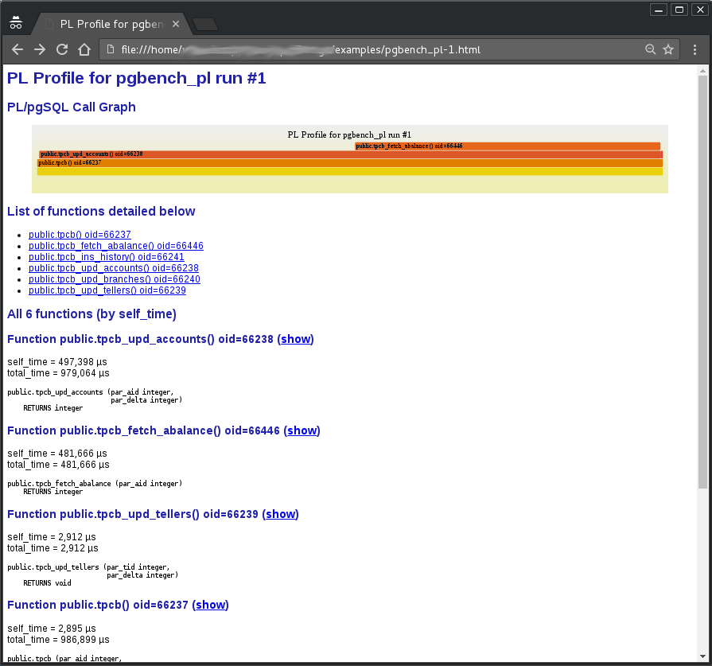

PL Profiler Extension
=====================

The **plprofiler** is an extension for the PostgreSQL database system to create performance profiles of PL/pgSQL functions and stored procedures. The included external Python class and command line utility can be used to easily control the extension, run arbitrary SQL commands (invoking PL/pgSQL functions), save and manage the resulting performance datasets and create HTML reports from them.

1. [Overview](#markdown-header-overview)
2. [Installation](doc/installation.md)
3. [Examples](doc/examples.md)
    * [The example test case](doc/examples.md#markdown-header-the-example-test-case)
    * [General command syntax](doc/examples.md#markdown-header-general-command-syntax)
	* [Executing SQL using the plprofiler utility](doc/examples.md#markdown-header-executing-sql-using-the-plprofiler-utility)
	* [Analyzing the first profile](doc/examples.md#markdown-header-analyzing-the-first-profile)
	* [Capturing profiling data by instrumenting the application](doc/examples.md#markdown-header-capturing-profiling-data-by-instrumenting-the-application)
	* [Collecting statistics at a timed interval](doc/examples.md#markdown-header-collecting-statistics-at-a-timed-interval)
	* [Collecting statistics via ALTER USER](doc/examples.md#markdown-header-collecting-statistics-via-alter-user)
	* [Profiling a live production system](doc/examples.md#markdown-header-profiling-a-live-production-system)
	* [Fixing the performance problem](doc/examples.md#markdown-header-fixing-the-performance-problem)
4. [plprofiler command reference](doc/plprofiler_cmd_ref.md)
    * [Command run](doc/plprofiler_cmd_ref.md#markdown-header-command-run)
    * [Command monitor](doc/plprofiler_cmd_ref.md#markdown-header-command-monitor)
    * [Command reset-data](doc/plprofiler_cmd_ref.md#markdown-header-command-reset-data)
    * [Command save](doc/plprofiler_cmd_ref.md#markdown-header-command-save)
    * [Command list](doc/plprofiler_cmd_ref.md#markdown-header-command-list)
    * [Command edit](doc/plprofiler_cmd_ref.md#markdown-header-command-edit)
    * [Command report](doc/plprofiler_cmd_ref.md#markdown-header-command-report)
    * [Command delete](doc/plprofiler_cmd_ref.md#markdown-header-command-delete)
    * [Command export](doc/plprofiler_cmd_ref.md#markdown-header-command-export)
    * [Command import](doc/plprofiler_cmd_ref.md#markdown-header-command-import)

Overview
--------

Finding performance problems within PL/pgSQL functions and stored procedures can be difficult, especially when the code is nested. This is because PL/pgSQL creates a cloak over whatever is happening inside. The only thing visible in system or extension views, such as `pg_stat_activity` or `pg_stat_statements` is the query, sent from the client. In the case of invoking a stored procedure, that is just the outermost stored procedure call. 

The **plprofiler** extension can be used to quickly identify the most time consuming functions and then drill down to find the individual statements within them.

The output, generated by the **plprofiler**, is a self-contained HTML document. The document starts with a [FlameGraph](http://www.brendangregg.com/FlameGraphs/cpuflamegraphs.html) at the top, followed by details about functions in the profile. Unlike usual CPU FlameGraphs, the **plprofiler** FlameGraph is based on the actual Wall-Clock time, spent in the PL/pgSQL functions. By default, the top ten functions, based on their self_time (total_time - children_time), are detailed. This can be overridden by the user.

Click on the screenshot below to see the actual, interactive report in your browser.

[`doc/pgbench_pl-1.html`](http://wi3ck.info/plprofiler/doc/pgbench_pl-1.html)

Please see the [Examples](doc/examples.md) for more details about this interactive report.

Credits for the FlameGraph go to [Brendan Gregg](http://www.brendangregg.com/). His `flamegraph.pl` script is used by the **plprofiler** utility to generate these incredibly powerful, interactive SVGs.

#####Major Change History
* 2012 - Removed from PostgreSQL plDebugger Extension
* 2015 - Resurrected as standalone plProfiler by OpenSCG
* 2016 - Rewritten as v2 to use shared hash tables, have lower overhead
* 2016 - v3 Major performance improvements, flame graph UI
* 2019 - v3.5 Placed all extension objects under role plprofiler for easier grant
