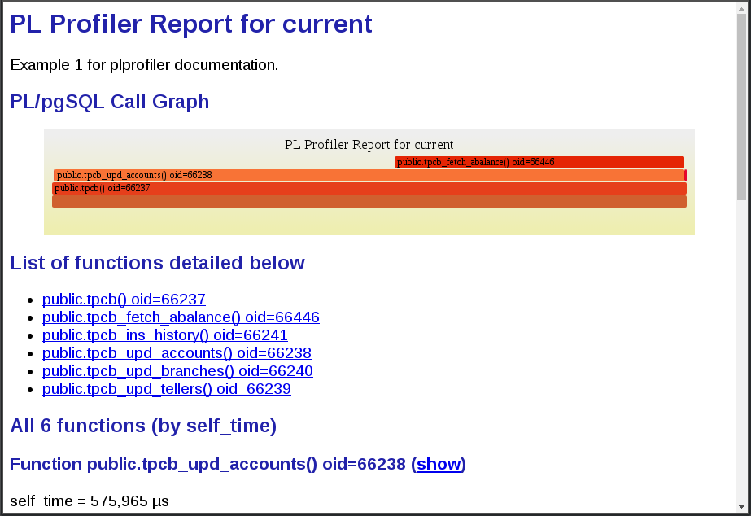
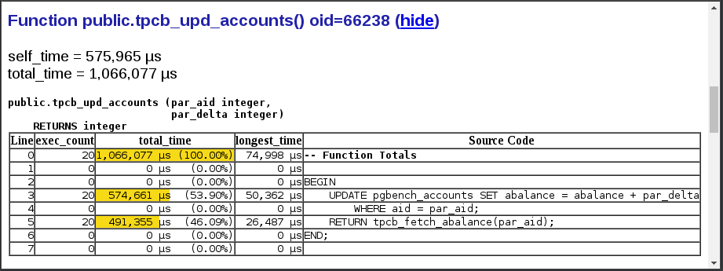
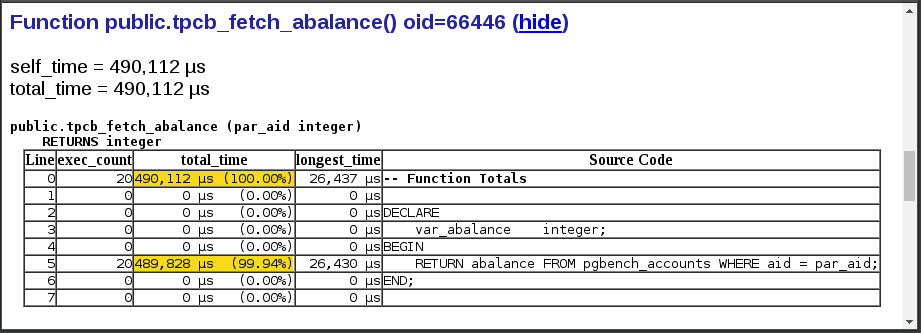
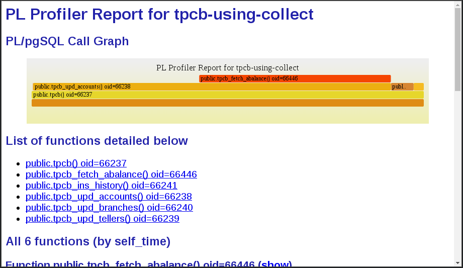
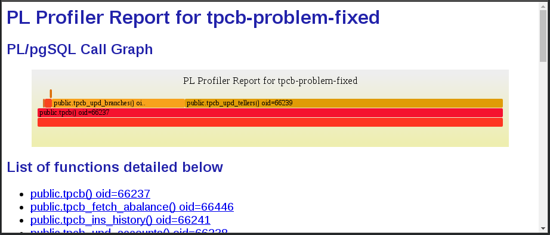

PL Profiler Examples
====================

In this tutorial style set of examples, I mostly want to demonstrate the different ways, **plprofiler** allows to capture profiling data.

The examples are built on top of each other so it is best to at least once read over this document top to bottom.

It is assumed that anyone, interested in profiling complex PL/pgSQL code, is familiar with performance testing in general and performance testing of a PostgreSQL database in particular. Therefore it is also also assumed that the reader has a basic understanding of the pgbench utility.

The example test case
---------------------

All examples in this documentation are based on a modified pgbench database. The modifications are:

* The SQL queries, that make up the TPC-B style business transaction of pgbench, have been implemented in a set of PL/pgSQL functions. Each function essentially performs only one of the TPC-B queries. This is on purpose convoluted, since for the sake of demonstration we want a simple, yet nested example. The function definitions can be found in [`examples/pgbench_pl.sql`](../examples/pgbench_pl.sql).
* A custom pgbench profile, found in [`examples/pgbench_pl.profile`](../examples/pgbench_pl.profile), is used with the -f option when invoking pgbench. 
* The table pgbench_accounts is modified.
    * The filler column is expanded and filled with 500 characters of data.
    * A new column, `category interger` is added in front of the aid and made part of the primary key.
	
The modifications to the pgbench_accounts table are based on a real world case, encountered in a customer database. This pgbench example case of course is greatly simplified. In the real world case the access to the table in question was in a nested function, 8 call levels deep, the table had several indexes to choose from and the schema contained a total of >500 PL/pgSQL functions with >100,000 lines of PL code. In other words the author was looking for a needle in what once was a haystack, but had been eaten by an elephant.

Despite the simplification, the problem produced by these modifications simulates the original case surprisingly well. The TPC-B transaction accesses the pgbench_accounts table based on the aid column alone, so that is the only key part, available in the WHERE clause. However, since the table rows are now >500 bytes wide and the index is rather small, compared to the heap, the PostgreSQL query optimizer will still choose an index scan. This is the right choice, based on the available options, because a sequential scan would be worse.

```
pgbench_plprofiler=# explain select abalance from pgbench_accounts where aid = 1;
                                            QUERY PLAN                                            
--------------------------------------------------------------------------------------------------
 Index Scan using pgbench_accounts_pkey on pgbench_accounts  (cost=0.42..18484.43 rows=1 width=4)
   Index Cond: (aid = 1)
```

Since the first column of the index is not part of the WHERE clause and thus, the index condition, this results in a full scan of the entire index! Unfortunately that detail is nowhere visible except in this explain output. And then you will only notice it if you know the definition of that index. If we look at pg_stat_* tables after a benchmark run for example, they only tell us that all access to pgbench_accounts was done via index scans over the primary key and that all those scans returned a single row. One would normally think "nothing wrong here".

On top of that, since the queries accessing the table will never show up in any statistics, we will never see that each of them takes 30ms already on a 10x pgbench scaling factor. Imagine what that turns into when we scale out.

The full script to prepare the pgbench test database is found in [`examples/prepdb.sh`](../examples/prepdb.sh).

To get a performance baseline, the median result of 5 times 5 minutes pgbench with 24 clients reports 136 TPS on an 8-core machine with 32GB of RAM and the entire database fitting into the 8GB of shared buffers (yeah, it is that bad).

```
(venv)[wieck@localhost examples]$ pgbench -n -c24 -j24 -T300 -f pgbench_pl.profile
transaction type: Custom query
scaling factor: 1
query mode: simple
number of clients: 24
number of threads: 24
duration: 300 s
number of transactions actually processed: 40686
latency average: 176.965 ms
tps = 135.580039 (including connections establishing)
tps = 135.589426 (excluding connections establishing)
```

Time to create a profile.

General command syntax
----------------------

The general syntax of the plprofiler utility is

`plprofiler COMMAND [OPTIONS]`

Common for all commands are options, that control the database connection. These are

Option                | Description
--------------------- | ------------------------
`-h, --host=HOST`     | The host to connect to.
`-p, --port=PORT`     | Port number the postmaster is listening on.
`-U, --user=USER`     | The database user name.
`-d, --dbname=DB`     | The database name, conninfo string or URI.

`plprofiler help [COMMAND]` will show you more details than are explained in the examples, provided in this document.

In the examples below it is assumed that the environment variables `PGHOST`, `PGPORT`, `PGUSER` and `PGDATABASE` have all been set to point to the pgbench_plprofiler database, that was created using the [`examples/prepdb.sh`](../examples/prepdb.sh) script. The above connection parameters are left out to make the examples more readable. For security reasons, there is not way to specify a password on the command line. Please create the necessary `~/.pgpass` entry if your database requires password authentication.

Executing SQL using the plprofiler utility
------------------------------------------

After having installed the **plprofiler** extension in the test database, the easiest way to generate a profile of PL/pgSQL functions is to run them using the plprofiler utility and let it create an HTML report directly from the in-memory-data, collected in the backend.

`plprofiler run --command "SELECT tpcb(1, 2, 3, -42)" --output tpcb-test1.html`

Since not all information for the HTML report was actually specified on the command line, the utility will launch your `$EDITOR` with a config file after the SQL statement finished, so you have a chance to change some of the defaults before it renders the HTML. At the end this will create the report `tpcb-test1.html` in the current directory, which should look more or less like the one, presented in the [Overview](../README.md).

One thing to keep in mind about this style of profiling is that there is a significant overhead in PL/pgSQL on the first call to a function within a database session (connection). The PL/pgSQL function call handler must parse the entire function definition and create a saved PL execution tree for it. Certain types of SQL statements will also be parsed and verified. For these reasons calling a truly trivial PL/pgSQL example like this can give very misleading results. 

To avoid this, the function should be called several times in a row. The file [`examples/tpcb_queries.sql`](../examples/tpcb_queries.sql) contains a set of 20 calls to the `tpcb()` function and can be executed as

`plprofiler run --file tpcb_queries.sql --output tpcb-test1.html`

Analyzing the first profile
---------------------------

The report generated by the last `plprofiler` command (the one with the --file option used) should look roughly like this (I narrowed the SVG FlameGraph from the default width of 1200 pixels to 800 to play nicer with embedding into markdown on bitbucket) and I set the tabstop to 4, which is how the SQL file for the PL functions is formatted:

[  ](http://wi3ck.info/plprofiler/doc/tpcb-test1.html)
[`doc/tpcb-test1.html`](http://wi3ck.info/plprofiler/doc/tpcb-test1.html)

Go ahead and open the actual HTML version in a separate window or tab to be able to interact with it.

What sticks out at the top of the FlameGraph are the two functions `tpcb_fetch_abalance()` and its caller, `tpcb_upd_accounts()`. When you hover over the FlameGraph entry for `tpcb_upd_accounts()` you will see that it actually accounted for over 99% of the total execution time, spent inside of PL/pgSQL functions.

To examine this function closer we scroll down in the report to the details of `tpcb_upd_accounts()` and click on the **(show)** link, we can see the source code of the function and the execution time spent in every single line of it.



Obviously there is a problem with accessing the pgbench_accounts table in that UPDATE statement. This function uses up 99% of our time and 50% of that is spent in a single row UPDATE statement? That cannot be right. 

Likewise if we examine the details for function `tpcb_fetch_abalance()`, we find that the same access path (single row SELECT via pgbench_accounts.aid) has the exact same performance problem.



Of course, this all was an excercise in [Hunting an Elephant the Experienced Programmer's way](https://paws.kettering.edu/~jhuggins/humor/elephants.html). I deliberately placed an elephant in the middle of the room and found it. Not much of a surprise. It is what it is, the artificial reproduction of a real world problem encountered in the wild. You will have to take my word for it that it was almost as easy to find the problem in the real world case, this example is based on.

We're not going to fix the actual problem (missing/wrong index) just yet, but explore alternative methods of invoking the **plprofiler** instead. This way we can compare all the different methods based on the same broken schema.

Capturing profiling data by instrumenting the application
---------------------------------------------------------

Sometimes it may be easier to add instrumentation calls to the application, than to extract stand alone queries, that can be run by the **plprofiler** via the --command or --file options. The way to do this is to add some **plprofiler** function calls at strategic places in the application code. In the case of pgbench, this *application code* is the custom profile [`pgbench_pl.collect.profile`](../examples/pgbench_pl.collect.profile).

```
\set nbranches :scale
\set ntellers 10 * :scale
\set naccounts 100000 * :scale
\setrandom aid 1 :naccounts
\setrandom bid 1 :nbranches
\setrandom tid 1 :ntellers
\setrandom delta -5000 5000
SELECT pl_profiler_enable(true);
SELECT tpcb(:aid, :bid, :tid, :delta);
SELECT pl_profiler_collect_data();
SELECT pl_profiler_enable(false);
```

The **plprofiler** extension creates several global tables in the schema, it is installed in. The two important ones (for now) are `pl_profiler_linestats_data` and `pl_profiler_callgraph_data`. In order to use this profiling method you need to be able to GRANT the application user(s) INSERT permission to these two tables. Since they are owned by default by a database superuser, you must be one too to do that.

The function `pl_profiler_enable(true)` will cause the **plprofiler** extension to be loaded and start accumulating profiling data in the in-memory-data hash tables. The function `pl_profiler_collect_data()` copies that in-memory-data over to the global tables and resets the in-memory-data counters to zero.

With this changed application code, we can run

```
plprofiler reset-data
pgbench -n -c24 -j24 -T300 -fpgbench_pl.collect.profile
```

The `reset-data` command truncates the two global tables. After pgbench has finished, we use the collected-data (the data, that has been copied by the `pl_profiler_collect_data()` function into the `pl_profiler_linestats_data` and `pl_profiler_callgraph_data` tables) to generate a report.

`plprofiler report --from-data --name "tpcb-using-collect" --output "tpcb-using-collect.html"`

[  ](http://wi3ck.info/plprofiler/doc/tpcb-using-collect.html)
[`doc/tpcb-using-collect.html`](http://wi3ck.info/plprofiler/doc/tpcb-using-collect.html)

There seems to be only a subtle change in the profile. The functions for updating the pgbench_branches and pgbench_tellers tables, which are almost invisible in the first profile, now used 5.81% and 2.60% of the time. That may not look like much, but with the access to pgbench_accounts being as screwed up as it is, this is in fact huge. The difference was caused by concurrency (24 clients).

The last pgbench run only showed a drop of the overall performance from 136 TPS to 132 TPS. But generating the report took considerably longer than before. This is because even at this bad performance and with this tiny amount of PL/pgSQL code involved, the **plprofiler** generated almost a million lines in the global tables, that need to be aggregated into the report. This is not going to work well if there are thousands of lines of PL/pgSQL code involved with a system, that runs at thousands of TPS.

For those reasons, this method of capturing profiling data is only useful for profiling a few rather infrequent but expensive PL/pgSQL functions.

Saving statistics at a timed interval
-------------------------------------

Instead of saving the in-memory-data after each individual transaction, we can configure it to copy the in-memory-data only every N seconds to the global collected-data tables (and reset the in-memory counters). The saving happens when a PL/pgSQL function exits and the timer has elapsed. This is not as accurate because if that automatic collection happens in a transaction, that later rolls back, those statistics get lost. The last interval at the end is also lost. But for the example at hand it is certainly suitable.

For this we use a slightly different pgbench custom profile, [`pgbench_pl.interval.profile`](../examples/pgbench_pl.interval.profile).

```
\set nbranches :scale
\set ntellers 10 * :scale
\set naccounts 100000 * :scale
\setrandom aid 1 :naccounts
\setrandom bid 1 :nbranches
\setrandom tid 1 :ntellers
\setrandom delta -5000 5000
SET plprofiler.enabled TO true;
SET plprofiler.save_interval TO 10;
SELECT tpcb(:aid, :bid, :tid, :delta);
```

I am not showing the resulting report for that because it is almost identical to the previous one. However, the collected-data in the global tables shrunk from almost a million rows to undere 20,000. Also, our performance is back up to 135 TPS.

Saving statistics via ALTER USER
--------------------------------

The above can also be done without changing the application code at all. Instead we can add the **plprofiler** to the `postgresql.conf` file in

`shared_preload_libraries = 'plprofiler'`

(requires PostgreSQL server restart) and then configure the application user as follows:

```
ALTER USER myuser SET plprofiler.enabled TO on;
ALTER USER myuser SET plprofiler.save_interval TO 10;
```

This has the exact same effect as the last example. It of course requires that the application reconnects after the `ALTER USER ...` statements to start collecting data, and it better reconnect once more when we are done profiling and did the corresponding `ALTER USER ... RESET ...` commands. So this is still not suitable for profiling a live production system since it is too disruptive.

Profiling a live production system
----------------------------------

#### Debugging as well as profiling on a production system is a risky business and should be avoided if at all possible.

Unfortunately sometimes it is not avoidable. For that reason, **plprofiler** has options designed to minimize its impact on performance.

Like the previous example, the profiling method demonstrated below requires to have **plprofiler** pre-loaded from the `postgresql.conf` file.

`shared_preload_libraries = 'plprofiler'`

This by itself is not a problem. The **plprofiler** will be loaded and place all callback functions into the PL instrumentation hooks. The first thing all these functions do is to check if profiling is enabled. If nothing is enabled, this check amounts to evaluating an

    `if (!bool_var && int_var != ptr->int_var) return;`

at the beginning of all the callback functions. One of the callback functions is called at every function enter/exit and at every PL statement start/end (only the statements, that actually have runtime functionality). In the great scheme of things, this overhead is negligible.

With `shared_preload_libraries` configured (and the database server restarted to let that take effect) and the collected-data tables empty (run `plprofiler reset-data`) we launch `pgbench` in the background and verify that no statistics are being collected in `pl_profiler_linestats_data` and `pl_profiler_callgraph_data`. After a while we get one of the pgbench backend PIDs by examining the system view `pg_stat_activity`. With that PID we run

```
plprofiler reset-data
plprofiler monitor --pid <PID> --interval 10 --duration 300
plprofiler report --from-data --name tpcb-using-monitor --output tpcb-using-monitor.html
```

The `plprofiler monitor` command is using `ALTER SYSTEM ...` and `SELECT pg_reload_conf()` to enable profiling and turn it back off after the specified duration. This obviously will only work with a PostgreSQL database version 9.4 or newer. As with any database maintenance operations, this should only be done in a connection loss safe environment as losing the connection in the middle of the monitoring would leave those settings behind permanently.

Leaving out the --pid option will cause ALL active backends to save their stats at the specified interval.

Since this time we were only capturing profiling data from one out of 24 backends, the total number of data rows colleted over 5 minutes is 731. But since they are the result of 10 second interval summaries, they are just as accurate as the previous example. Again I am not including the actual **plprofiler** output because it is again just a repetition of what we already know.

Fixing the performance problem
------------------------------

In this final chapter of this tutorial we fix the artificially introduced performance problem as it was done in the real world case that stood model for it. We create the missing index.

```
CREATE INDEX pgbench_accounts_aid_idx ON pgbench_accounts (aid);
```

With that in place we use our last method of capturing profiling data once more to generate the last report for this tutorial.

```
plprofiler reset-data
plprofiler monitor --pid <PID> --interval 10 --duration 300
plprofiler report --from-data --name tpcb-problem-fixed --output tpcb-problem-fixed.html
```
[  ](http://wi3ck.info/plprofiler/doc/tpcb-problem-fixed.html)
[`doc/tpcb-problem-fixed.html`](http://wi3ck.info/plprofiler/doc/tpcb-problem-fixed.html)

The performance profile is now completely reversed. The access to pgbench_accounts is a small fraction (1.52% with 0.44% out of that accouting for fetching the new account balance) of the overall time spent. The access to pgbench_tellers and pgbench_branches completely dominates the picture. This is how a pgbench running inside of shared buffer is supposed to look like. Because the tellers and branches tables are so small, there is tremendous row level lock contention and constant bloat on them.

The overall performance of pgbench went from the original 136 TPS to a whooping 

```
transaction type: Custom query
scaling factor: 1
query mode: simple
number of clients: 24
number of threads: 24
duration: 300 s
number of transactions actually processed: 1086292
latency average: 6.628 ms
tps = 3620.469364 (including connections establishing)
tps = 3620.869051 (excluding connections establishing)
```

This is a performance boost by factor 27 for one additional index.

Not all performance problems are this easy to solve. But I hope the **plprofiler** will help you locating them quickly, so you have more time fixing them.
